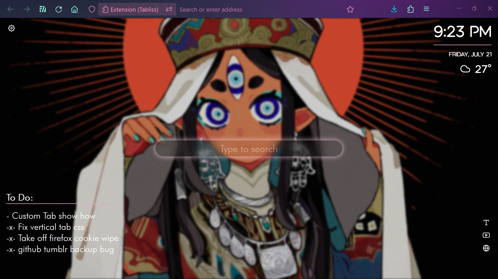

# Magz Firefox Customizations

Personal tweaks and edits Magz use for Firefox browser.

For now, includes:

- Custom "new tab" page and "homepage" (using Tabliss add-on and the Custom CSS option)

- Collapsible and "modern" vertical tabs that adapts to most Firefox themes (using Sidebery 5 add-on and Custom CSS)

(README to be updated...)

## Screenshots and Demonstration

#### Screenshots:

#### Videos:

Demonstration of Tabliss "custome homepage" and Sidebery 5 customization
https://github.com/cristaldotgema/Magz-Firefox-Tweaks/blob/main/examples/Showcase1.mp4

Vertical Sidebar Adapting to Different Firefox Themes
https://github.com/cristaldotgema/Magz-Firefox-Tweaks/blob/main/examples/Showcase2.mp4

#### Template:

Will see this when first import Tabliss data though:

## Installation

- Download this Github Repository as a .zip file

(Click the "Code" button, then "Download .Zip")

- Unzip the file somewhere you'll remember.

### The Custom Homepage Tab:

- Install [Tabliss](https://tabliss.io/) add-on. (or test out [the web version](https://web.tabliss.io/) first).
- Click the cog wheel (settings) on the new Tabliss page, scroll down and click "import" settings.

- Import the "tabliss.json" file. It will be in the .zip file downloaded from the github repository, in the "Tabliss" section.

- This imports the base template with the few custom CSS tweaks and layout.
- Change the text, the city used for the weather, the links shortcuts, upload images you want for the background, and anything else to suit your needs. 

### Vertical Tabs SideBar

- Install [Sidebery 5 beta](https://github.com/mbnuqw/sidebery) from the Github page.

- Type ``about:config`` in browser url bar. Search ``toolkit.legacyUserProfileCustomizations.stylesheets`` and change to "true", if it wasn't before. This allows for browser profile customization.

- Type ``about:profiles`` and click the "root directory" folder.

- Copy-Paste the "chrome" folder in the Firefox tweaks unzipped file, into the root directory folder.

- Copy-Paste the "sidebery" folder into the "chrome" folder, or have the "sidebery" folder somewhere that won't get accidentally deleted.

- Right-click the Sidebery Sidebar or the Sidebery add-on icon on the Firefox browser. Click "open settings" or "configure panel".

- In the Sidebery Settings menu, click "help" section, then "import add-on data" and select the "sidebery-data.json" file in the "sidebery" folder from unzipped github folder.

- Close Firefox, and open it again for both the Sidebery style settings and the Browser settings to take effect.

  
## Acknowledgements / Credits

### Code:
- [Firefox Vertical Tabs](https://github.com/ranmaru22/firefox-vertical-tabs) by ranmaru22. (Used the "userChrome.css" from this)

- ["Yet another Sidebery setup"](https://www.reddit.com/r/FirefoxCSS/comments/rmi8dg/yet_another_sidebery_setup/) by a deleted Reddit user. (Used the "userChrome.css" from this, and used the sidebery stylesheet as a base - heavily edited)

- [Tabliss's developer](https://github.com/joelshepherd/) - The homepage setup uses the Tabliss add-on

- [Sidebery's developer](https://github.com/mbnuqw/) - The sidebar uses the Sidebery add-on

### Featured Graphics and themes:

These were used in the demonstration as example images. They are not in the github repository, nor being redistributed as part of customization setup.

#### Example Background Images by:
- _ Roitz _ 
- killian ng 
- nymria 
- Senbon Umishima 
- siun_5513 
- sumi
- swdrk_ 
- lirseven 
- zephyo

#### Example themes:
- Dark neon. 
- Carribean Current.
- Dark.
- Dark Pink (pink).
- Firefox Alpenglow.
- Innovator (Bold).
- Light.
- Lush (Bold).
- Matte Black (pink).
- Rainbow Pastel.
- Stained Glass.

#### Time:
(For reference: Published July 21, 2023 - using latest Firefox at time, version 115.0.2)
